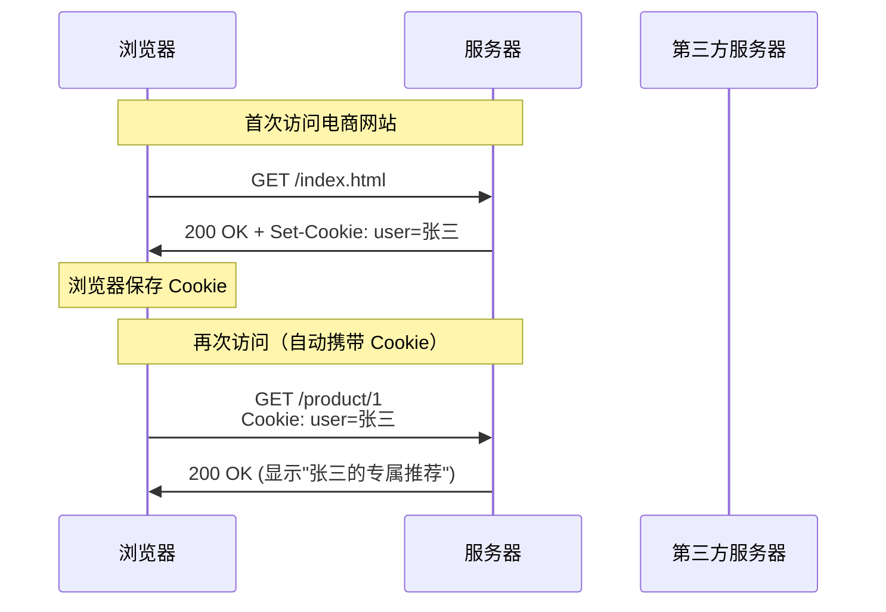
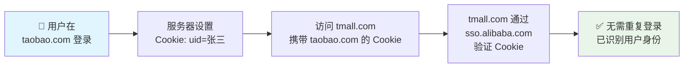
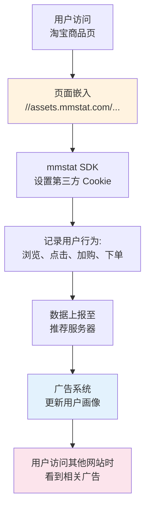
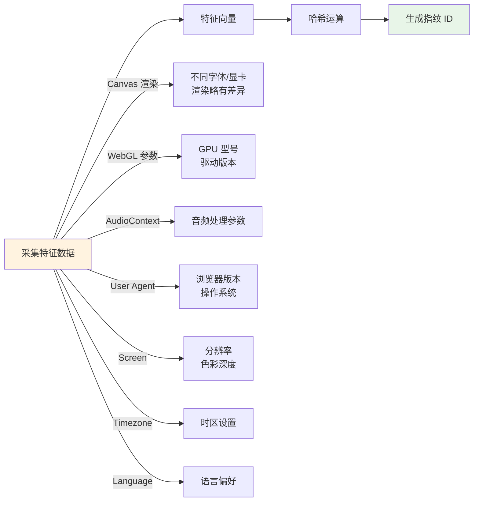
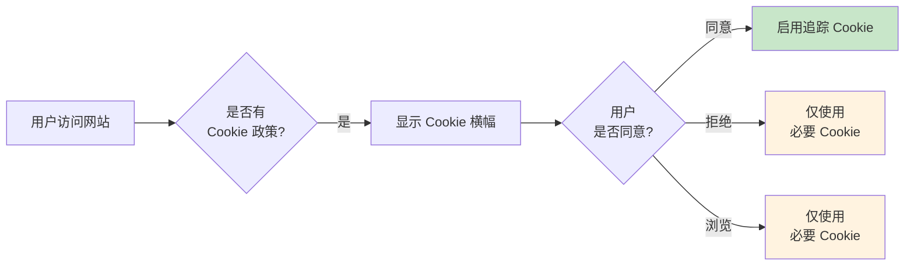
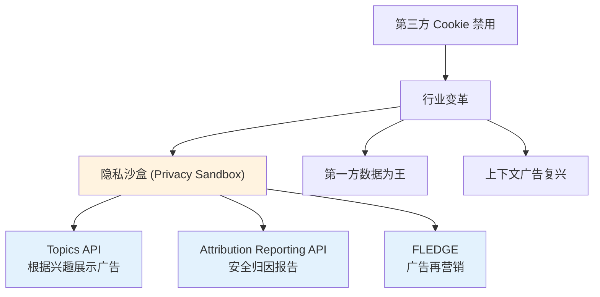

# 第三方 Cookie 完整指南

> 本文将深入解析第三方 Cookie 的工作原理、应用场景、以及在浏览器隐私政策收紧背景下的应对策略。

---

## 1. Cookie 的意义

### 1.1 HTTP 无状态协议

HTTP 是一种**无状态协议**（Stateless Protocol）。这意味着每次浏览器向服务器发送请求时，服务器都会将其视为**一次全新的独立请求**，完全不记得之前发生了什么。

```
┌─────────┐     请求 A (你好，我是张三)      ┌─────────┐
│  浏览器  │ ──────────────────────────────→ │  服务器  │
│         │ ←────────────────────────────── │         │
└─────────┘     响应 A (你好，张三)          └─────────┘

┌─────────┐     请求 B (我要买这件衣服)      ┌─────────┐
│  浏览器  │ ──────────────────────────────→ │  服务器  │
│         │ ←────────────────────────────── │         │
└─────────┘     响应 B (你是谁？)           └─────────┘
                          ↑
                    服务器不认识你了！
```

### 1.2 Cookie 如何解决状态问题

**Cookie** 是服务器发送到用户浏览器并存储在本地的小型文本数据。每次浏览器向同一服务器发起请求时，会自动携带这些数据，从而让服务器"记住"用户身份。

```
┌─────────┐     首次请求 (无 Cookie)         ┌─────────┐
│  浏览器  │ ──────────────────────────────→ │  服务器  │
│         │ ←────────────────────────────── │  服务器  │
└─────────┘   Set-Cookie: session=abc123     └─────────┘
                          ↓
              浏览器将 cookie 存储在本地
                          ↓
┌─────────┐     再次请求 (携带 Cookie)        ┌─────────┐
│  浏览器  │ ──────────────────────────────→ │  服务器  │
│         │   Cookie: session=abc123        │         │
│         │ ←────────────────────────────── │  认出你了！│
└─────────┘     响应 (个性化内容)            └─────────┘
```

### 1.3 Cookie 的工作流程



### 1.4 Cookie 的技术细节

```http
# 服务器设置 Cookie (HTTP 响应头)
Set-Cookie: session_id=abc123; 
            Path=/; 
            Expires=Wed, 21 Oct 2026 07:28:00 GMT; 
            HttpOnly; 
            Secure; 
            SameSite=Lax
```

```text
# Cookie 的关键属性
- Name/Value:     Cookie 的名称和值
- Expires/Max-Age: 过期时间
- Path:           生效路径（/ 表示整站）
- Domain:         生效域名
- HttpOnly:       仅 HTTP 传输，禁止 JS 访问（防 XSS）
- Secure:         仅 HTTPS 传输
- SameSite:       跨站请求策略
```

---

## 2. 什么是第三方 Cookie

### 2.1 第一方 vs 第三方

区分**第一方（First-Party）** 和 **第三方（Third-Party）** 的关键在于：**当前浏览的页面域名** vs **Cookie 所属的域名**。

| 类型 | 定义 | 示例 |
|------|------|------|
| **第一方 Cookie** | 由当前访问的网站设置的 Cookie | 在 taobao.com 设置的 `user_id` |
| **第三方 Cookie** | 由当前页面上的**第三方域名**设置的 Cookie | 在 taobao.com 页面中，嵌入的 `mmstat.com` 域名设置的 Cookie |

```
┌──────────────────────────────────────────────────────┐
│  浏览器地址栏: https://www.taobao.com               │
│                                                      │
│   ┌─────────────────────────────┐                   │
│   │      淘宝页面 (第一方)        │                   │
│   │                              │                   │
│   │   ┌──────────────────────┐   │                   │
│   │   │  淘宝 Logo (img)     │   │ ← taobao.com     │
│   │   │  来自: img.taobao.com│   │                   │
│   │   └──────────────────────┘   │                   │
│   │                              │                   │
│   │   ┌──────────────────────┐   │                   │
│   │   │  广告图片 (img)       │   │                   │
│   │   │  来自: ad.alimama.com │───┼──→ 第三方 Cookie
│   │   └──────────────────────┘   │   (广告平台)
│   │                              │                   │
│   │   ┌──────────────────────┐   │                   │
│   │   │  数据统计 SDK (js)   │   │                   │
│   │   │  来自: mmstat.com    │───┼──→ 第三方 Cookie
│   │   └──────────────────────┘   │   (数据统计)
│   └─────────────────────────────┘                   │
└──────────────────────────────────────────────────────┘
```

### 2.2 典型场景：淘宝/天猫登录共享

淘宝（taobao.com）和天猫（tmall.com）同属阿里巴巴集团。用户在一个平台登录后，在另一个平台无需重复登录，这背后就有**第三方 Cookie 共享**的功劳。



### 2.3 第三方 Cookie 的技术原理

```javascript
// 第三方域名的 JS 嵌入到页面中
// 文件: https://ad.alimama.com/third-party.js

// 1. 创建隐藏的 iframe 或直接通过 JS 设置
document.cookie = "ad_tracking=user_123456; domain=alimama.com; path=/";

// 2. 当用户访问其他也嵌入该 JS 的网站时
//    浏览器会自动携带这个 Cookie

// 3. 广告平台读取 Cookie，关联用户画像
// https://ad.alimama.com/collect?cookie=ad_tracking=user_123456&...
```

---

## 3. 第三方 Cookie 的用途

### 3.1 前端日志打点（第三方 SDK）

很多网站使用第三方数据分析服务来统计用户行为，如 PV/UV、点击热图、用户路径等。

```
┌─────────────────────────────────────────────────────┐
│  业务网站 A (example.com)                           │
│                                                     │
│   嵌入: <script src="//analytics.com/sdk.js">      │
│                                                     │
│   用户访问页面 → 第三方 SDK 记录:                    │
│   - 页面浏览量 +1                                   │
│   - 停留时间开始计时                                 │
│   - 用户身份（通过第三方 Cookie 关联）                │
└─────────────────────────────────────────────────────┘
           │
           │ 定时上报 (每 30 秒或页面离开时)
           ↓
┌─────────────────────┐
│  analytics.com      │
│  收集所有嵌入该 SDK  │
│  的网站数据          │
└─────────────────────┘
```

```javascript
// 第三方分析 SDK 示例逻辑 (伪代码)
window.analytics = {
  sessionId: getCookie('analytics_session'),
  
  trackPageView: function() {
    // 通过第三方 Cookie 标识用户
    this.sendBeacon({
      session: this.sessionId,
      page: location.href,
      referrer: document.referrer,
      timestamp: Date.now()
    });
  },
  
  sendBeacon: function(data) {
    // 发送数据到第三方服务器
    navigator.sendBeacon('https://analytics.com/collect', JSON.stringify(data));
  }
};

// 页面加载时自动触发
analytics.trackPageView();
```

### 3.2 广告追踪（Facebook Pixel）

**Facebook Pixel** 是一种追踪代码，嵌入广告主的网站后，可以追踪用户在网站内的行为，用于广告效果优化和再营销（Retargeting）。

```
┌─────────────────────────────────────────────────────────┐
│                    广告追踪流程                          │
│                                                         │
│  ┌──────────────┐      ┌──────────────┐                 │
│  │ 用户访问      │      │ Facebook     │                 │
│  │ 电商网站      │ ───→ │ Pixel 读取   │                 │
│  │ (商品页)      │      │ 第三方 Cookie │                 │
│  └──────────────┘      └──────┬───────┘                 │
│                               │                         │
│                               │ 记录事件:               │
│                               │ - PageView              │
│                               │ - ViewContent           │
│                               │ - AddToCart             │
│                               ↓                         │
│                        ┌──────────────┐                 │
│                        │ Facebook     │                 │
│                        │ 广告后台      │                 │
│                        │ 累计用户画像   │                 │
│                        └──────────────┘                 │
│                               │                         │
│         ┌─────────────────────┼─────────────────────┐  │
│         ↓                     ↓                     ↓  │
│  ┌──────────────┐      ┌──────────────┐      ┌──────────────┐
│  │ 用户刷       │      │ Facebook     │      │ 看到个性化   │
│  │ Facebook     │ ←─── │ 检测到 Cookie │ ───→ │ 广告！       │
│  │ 信息流        │      │ 匹配用户画像  │      │ (再营销)     │
│  └──────────────┘      └──────────────┘      └──────────────┘
```

```javascript
// Facebook Pixel 代码示例
<script>
  !function(f,b,e,v,n,t,s)
  {if(f.fbq)return;n=f.fbq=function(){n.callMethod?
  n.callMethod.apply(n,arguments):n.queue.push(arguments)};
  if(!f._fbq)f._fbq=n;n.push=n;n.loaded=!0;n.version='2.0';
  n.queue=[];t=b.createElement(e);t.async=!0;
  t.src=v;s=b.getElementsByTagName(e)[0];
  s.parentNode.insertBefore(t,s)}(window, document,'script',
  'https://connect.facebook.net/en_US/fbevents.js');

  // 初始化 Pixel（使用第三方 Cookie 追踪用户）
  fbq('init', 'YOUR_PIXEL_ID');
  
  // 追踪页面浏览
  fbq('track', 'PageView');
  
  // 追踪特定事件
  fbq('track', 'ViewContent', {
    content_ids: ['product_123'],
    content_type: 'product',
    value: 99.99,
    currency: 'USD'
  });
</script>
```

### 3.3 国内案例：阿里妈妈 mmstat

**阿里妈妈**是阿里巴巴集团的广告技术平台，其 **mmstat.com**（及相关域名）为淘宝、天猫等电商平台提供数据统计和广告追踪服务。



```javascript
// 阿里妈妈数据追踪（简化示意）
// 该脚本由阿里巴巴提供，嵌入商家店铺页面

(function() {
  // 生成或读取用户标识（第三方 Cookie）
  var userId = getCookie('wsuid') || generateUUID();
  setCookie('wsuid', userId, 365 * 10); // 有效期10年
  
  // 收集页面信息
  var mmdata = {
    uId: userId,
    p: location.pathname,        // 当前页面
    r: document.referrer,         // 来源页面
    t: Date.now(),               // 时间戳
    spm: 'a21bo.2017.201894'      // 淘宝内部埋点标识
  };
  
  // 上报数据
  var img = new Image();
  img.src = '//mmstat.alibaba.com/actionJson.htm?' + encodeParams(mmdata);
})();
```

---

## 4. 浏览器策略变化

### 4.1 主流浏览器的立场

| 浏览器 | 第三方 Cookie 策略 | 备注 |
|--------|-------------------|------|
| **Safari** | 默认**完全阻止** | 启用**Intelligent Tracking Prevention (ITP)** |
| **Firefox** | 默认**阻止** | 启用**Enhanced Tracking Protection (ETP)** |
| **Chrome** | 逐步**淘汰**中 | 2024 年开始限制，2025 年完全禁用 |

### 4.2 SameSite 属性详解

`SameSite` 是 Cookie 的关键安全属性，控制 Cookie 在跨站请求中的发送行为。

```http
Set-Cookie: session=abc123; SameSite=Strict
Set-Cookie: tracking=xyz789; SameSite=Lax
Set-Cookie: ads=aaa; SameSite=None; Secure
```

| 值 | 行为 | 典型用途 |
|----|------|----------|
| **`Strict`** | 仅在**同站**请求中发送 | 银行、敏感操作的核心 Cookie |
| **`Lax`** | 同站请求 + 顶级导航的跨站请求（GET） | 兼顾安全性与用户体验 |
| **`None`** | 无限制，但必须配合 `Secure`（HTTPS） | 第三方嵌入式服务的 Cookie |

```mermaid
flowchart TD
    A["用户从外部链接<br/>点击进入网站"] --> B{请求类型}
    
    B -->|GET (导航) | C["Lax: ✅ 发送 Cookie"]
    B -->|POST | D["Lax: ❌ 不发送 Cookie"]
    B -->|iframe | E["Strict/Lax: ❌ 不发送"]
    
    F["同站请求<br/>(same-site)"] --> G["✅ 始终发送"]
    
    H["跨站请求<br/>(cross-site)"] --> I{JS 发起}
    H --> J{表单 POST}
    H --> K{图片/脚本}
    
    I --> L["None+Secure: ✅<br/>其他: ❌"]
    J --> M["Lax: ✅ (GET)"]
    J --> N["其他: ❌"]
    K --> O["取决于 SameSite 值"]
    
    style C fill:#c8e6c9
    style G fill:#c8e6c9
    style L fill:#c8e6c9
    style M fill:#c8e6c9
    style N fill:#ffcdd2
    style E fill:#ffcdd2
```

### 4.3 Chrome 的政策时间线

| 时间 | 版本 | 变更内容 |
|------|------|----------|
| 2019 | Chrome 76 | 默认拒绝无 SameSite 的 Cookie |
| 2020 | Chrome 80 | SameSite=Lax 成为默认值；无效的 SameSite=None 被拒绝 |
| 2021 | Chrome 89+ | 隐私沙盒里程碑 |
| 2022 | Chrome 89+ | 逐步淘汰 Manifest V3 |
| 2024 | Chrome 126 | 开始在无痕模式下阻止第三方 Cookie |
| 2025 | Chrome 131 | 计划全面禁用第三方 Cookie |

### 4.4 SameSite 默认值变化的影响

```
Chrome 77 之前:
  Set-Cookie: session=abc  
  → 无 SameSite → 任何请求都发送 ❌  (不安全)

Chrome 77-79:
  Set-Cookie: session=abc  
  → 自动被视为 Lax ✓  (仅安全和顶级导航跨站发送)

Chrome 80+:
  Set-Cookie: session=abc; SameSite=Lax  ← 显式声明
  Set-Cookie: third_party=xyz; SameSite=None; Secure ← 第三方需加此声明
```

---

## 5. 全面禁用后的影响

### 5.1 前端日志异常

当第三方 Cookie 被完全禁用后，依赖它的数据分析平台将面临**用户识别断裂**的问题：

```
禁用前:
┌─────────────┐     Cookie: u_id=user_12345      ┌──────────────┐
│ 用户浏览器   │ ─────────────────────────────────→ │ 数据统计平台  │
│             │                                    │  正确关联用户 │
└─────────────┘                                    └──────────────┘

禁用后:
┌─────────────┐     Cookie: (空的或新的随机值)      ┌──────────────┐
│ 用户浏览器   │ ─────────────────────────────────→ │ 数据统计平台  │
│             │                                    │  每次访问都    │
│             │                                    │  视为新用户!   │
└─────────────┘                                    └──────────────┘
```

```javascript
// 第三方 SDK 视角: Cookie 读取失败
document.cookie = 'analytics_uid=xxx'; // 写入
console.log(document.cookie); 
// 严格跨站模式下 → 空字符串 ""
// 只能读取到当前站点的第一方 Cookie
```

### 5.2 智能广告推荐消失

广告平台依赖第三方 Cookie 建立用户画像。禁用后：

```
影响链:
1. 无法跨站追踪用户
      ↓
2. 用户画像归零（从"已知用户"变为"匿名访客"）
      ↓
3. 广告平台只能依赖:
   - 第一方数据（网站自身积累的用户数据）
   - 上下文广告（根据当前页面内容，而非用户兴趣）
      ↓
4. 广告相关度下降 → 点击率下降 → 广告主 ROI 降低
```

### 5.3 无法追踪转化率

**归因分析**（Attribution）是广告投放的核心——追踪"用户从看到广告到完成购买的完整路径"。

```
典型转化路径:
Facebook广告 → 落地页 → 加入购物车 → 付款页 → 购买成功
    ↑                                              ↑
  广告曝光                                    转化完成
    │                                              │
    └──────── 第三方 Cookie 关联这整个链路 ─────────┘

禁用后:
    Facebook广告 → (Cookie 被阻断)→ 无法关联 → 落地页
                                              ↓
                                     广告平台无法知道
                                     这个用户是否最终购买
```

### 5.4 影响范围一览

| 场景 | 第三方 Cookie 禁用前 | 第三方 Cookie 禁用后 |
|------|---------------------|---------------------|
| 用户识别 | 跨站唯一标识 | 仅同站识别 |
| 广告追踪 | 完整的用户旅程 | 只能在同站内追踪 |
| 数据统计 | 准确的去重 UV | 只能估算（基于 IP/UA 等） |
| 再营销 | 精准的个性化推荐 | 只能基于上下文 |
| 广告归因 | 准确的多触点归因 | 归因窗口大幅缩短 |

---

## 6. 替代方案

### 6.1 第一方 Cookie 替代方案

#### Google Analytics 4 (GA4) - gtag.js

GA4 已经支持基于**第一方 Cookie** 的用户追踪，通过配置 `cookie_flags` 来适配新的浏览器策略。

```html
<!-- GA4 第一方 Cookie 配置 -->
<script async src="https://www.googletagmanager.com/gtag/js?id=G-XXXXXXXX"></script>
<script>
  window.dataLayer = window.dataLayer || [];
  function gtag(){dataLayer.push(arguments);}
  
  gtag('js', new Date());
  
  gtag('config', 'G-XXXXXXXX', {
    // 使用第一方 Cookie 模式
    cookie_prefix: '_ga',
    cookie_domain: 'example.com',        // 设置为第一方域名
    cookie_flags: 'SameSite=Lax;Secure',  // 适配新策略
    
    // 禁用第三方 Cookie 依赖
    allow_google_signals: false,
    allow_ad_personalization_signals: false
  });
</script>
```

#### Universal Analytics (analytics.js) 迁移

```javascript
// 旧版 analytics.js 依赖第三方 Cookie
ga('create', 'UA-XXXXX-Y', 'auto'); // 跨域追踪受限

// 新方案: 配置第一方 Cookie
ga('create', 'UA-XXXXX-Y', {
  'cookieDomain': 'example.com',       // 第一方域名
  'cookieFlags': 'SameSite=Lax;Secure;Path=/',
  'storage': 'first-party-schema'      // 强制第一方存储
});
```

### 6.2 浏览器指纹识别

**浏览器指纹**（Browser Fingerprinting）通过采集浏览器和设备的多种特征，生成唯一标识符来识别用户，无需依赖 Cookie。



#### Canvas 指纹

```javascript
// Canvas 指纹原理：不同设备渲染图形有细微差异
function getCanvasFingerprint() {
  var canvas = document.createElement('canvas');
  var ctx = canvas.getContext('2d');
  
  // 绘制包含文字和图形的复杂图案
  ctx.textBaseline = 'top';
  ctx.font = "14px 'Arial'";
  ctx.fillStyle = '#f60';
  ctx.fillRect(125, 1, 62, 20);
  ctx.fillStyle = '#069';
  ctx.fillText('Fingerprint', 2, 15);
  ctx.fillStyle = 'rgba(102, 204, 0, 0.7)';
  ctx.fillText('Canvas', 4, 17);
  
  // 提取画布数据的哈希值
  var dataUrl = canvas.toDataURL();
  return hashCode(dataUrl);
}

function hashCode(str) {
  var hash = 0;
  for (var i = 0; i < str.length; i++) {
    var char = str.charCodeAt(i);
    hash = ((hash << 5) - hash) + char;
    hash = hash & hash;
  }
  return Math.abs(hash).toString(36);
}
```

#### WebGL 指纹

```javascript
// WebGL 指纹：获取 GPU 相关信息
function getWebGLFingerprint() {
  var canvas = document.createElement('canvas');
  var gl = canvas.getContext('webgl') || canvas.getContext('experimental-webgl');
  
  if (!gl) return null;
  
  var debugInfo = gl.getExtension('WEBGL_debug_renderer_info');
  
  return {
    vendor: gl.getParameter(gl.VENDOR),              // GPU 厂商
    renderer: gl.getParameter(debugInfo.UNMASKED_RENDERER_WEBGL), // GPU 型号
    maxTextureSize: gl.getParameter(gl.MAX_TEXTURE_SIZE),
    maxViewportDims: gl.getParameter(gl.MAX_VIEWPORT_DIMS),
    extensions: gl.getSupportedExtensions().length
  };
}
```

#### WebRTC 指纹

```javascript
// WebRTC 指纹：获取本地 IP 地址
function getWebRTCFingerprint() {
  return new Promise(function(resolve) {
    var ips = new Set();
    var RTCPeerConnection = window.RTCPeerConnection || 
                            window.mozRTCPeerConnection || 
                            window.webkitRTCPeerConnection;
    
    if (!RTCPeerConnection) {
      resolve([]);
      return;
    }
    
    var pc = new RTCPeerConnection({ iceServers: [] });
    
    pc.createDataChannel('');
    
    pc.onicecandidate = function(e) {
      if (!e.candidate) {
        resolve(Array.from(ips));
        return;
      }
      
      // 解析 IP 地址（从 ICE candidate 中提取）
      var match = /([0-9]{1,3}(\.[0-9]{1,3}){3}|[a-f0-9]{1,4}(:[a-f0-9]{1,4}){7})/.exec(e.candidate.candidate);
      if (match) {
        ips.add(match[1]);
      }
    };
    
    pc.createOffer(function(offer) {
      pc.setLocalDescription(offer);
    }, function() {});
  });
}
```

#### CSS 指纹

```javascript
// CSS 指纹：检测浏览器特定的 CSS 属性支持
function getCSSFingerprint() {
  var features = [
    // 特定前缀
    ['webkitTransform', '-webkit-transform'],
    ['mozTransform', '-moz-transform'],
    ['msTransform', '-ms-transform'],
    ['oTransform', '-o-transform'],
    // 特定属性
    ['scroll-behavior', 'smooth'],
    ['user-select', 'none']
  ];
  
  var hash = 0;
  
  features.forEach(function(item) {
    var supported = item[0] in document.documentElement.style;
    var prefixed = getComputedStyle(document.body)['-webkit-' + item[1]] !== undefined;
    hash ^= (supported ? 1 : 0) << (features.indexOf(item) % 8);
  });
  
  return hash.toString(36);
}
```

### 6.3 clientjs 库

**clientjs** 是一个流行的浏览器指纹库，封装了多种指纹采集方法。

```html
<script src="https://cdn.jsdelivr.net/npm/clientjs@0.1.11/dist/client.min.js"></script>
<script>
  var client = new ClientJS();
  
  // 采集多种指纹
  var fingerprint = client.getFingerprint();      // 综合指纹
  var canvas = client.getCanvasPrint();           // Canvas 指纹
  var webgl = client.getWebGL();                  // WebGL 参数
  var fonts = client.getFonts();                  // 已安装字体
  var plugins = client.getPlugins();              // 浏览器插件
  var timezone = client.getTimeZone();            // 时区
  var language = client.getLanguage();            // 语言
  var canvas = client.getCanvasFingerprint();    // Canvas hash
  
  console.log('Browser Fingerprint:', fingerprint);
  console.log('Canvas Fingerprint:', canvas);
  console.log('WebGL Renderer:', webgl);
  
  // 可用于发送分析数据
  // fetch('/api/track', {
  //   method: 'POST',
  //   body: JSON.stringify({ fingerprint: fingerprint, ... })
  // });
</script>
```

### 6.4 替代方案对比

| 方案 | 准确性 | 稳定性 | 隐私争议 | 抗干扰性 |
|------|--------|--------|----------|----------|
| **第一方 Cookie** | 高 | 高 | 低 | 低（用户可清除） |
| **浏览器指纹** | 中 | 中 | 高（追踪用户） | 中（可通过修改UA等伪造） |
| **LocalStorage** | 高 | 高 | 中 | 低（同源限制） |
| **IndexedDB** | 高 | 高 | 中 | 低（同源限制） |
| **ETags** | 高 | 中 | 中 | 中（服务端可追踪） |
| **IP + User-Agent** | 低 | 低 | 低 | 高 |

---

## 7. 安全与隐私思考

### 7.1 隐私保护的核心矛盾

```
用户隐私 ←──────────────→ 商业利益
    |                          |
    ↓                          ↓
不想被追踪                 广告需要精准投放
    |                          |
    ↓                          ↓
清除 Cookie              Cookie 追踪用户
    |                          |
    ↓                          ↓
广告主无法归因            用户感觉被监视
```

### 7.2 隐私法规演进

| 法规 | 生效时间 | 核心要求 |
|------|----------|----------|
| **GDPR** (欧盟) | 2018 年 5 月 | 明确同意、 数据访问权、被遗忘权 |
| **CCPA** (加州) | 2020 年 1 月 | 退出数据销售的权利 |
| **PIPL** (中国) | 2021 年 11 月 | 个人信息收集需获得同意 |
| **Cookie Law** (欧盟) | 2019 年前 | Cookie 使用需获得明确同意 |



### 7.3 开发者应对策略

```javascript
// 1. 实施 Cookie 同意机制
var cookieConsent = {
  necessary: true,   // 必要 Cookie，不需同意
  analytics: false,  // 分析 Cookie
  marketing: false   // 营销 Cookie
  
  // 存储用户选择
  save: function() {
    localStorage.setItem('cookie_consent', JSON.stringify(this));
    this.apply();
  },
  
  // 应用用户选择
  apply: function() {
    if (!this.analytics) disableAnalytics();
    if (!this.marketing) disableMarketing();
  }
};

// 2. 优雅降级：当第三方 Cookie 不可用时
function trackEvent(eventName, data) {
  if (navigator.cookieEnabled) {
    // 使用第一方 Cookie
    sendToAnalytics({ ...data, source: 'first_party' });
  } else {
    // 使用 fingerprint 作为备选
    var fp = new ClientJS().getFingerprint();
    sendToAnalytics({ ...data, source: 'fingerprint', fingerprint: fp });
  }
}

// 3. SameSite 属性最佳实践
// 生产环境应设置:
// - 必要 Cookie: SameSite=Strict 或 Lax
// - 第三方嵌入必需: SameSite=None; Secure (仅 HTTPS)
```

### 7.4 隐私友好的未来



---

## 参考链接

### 官方文档
- [MDN - HTTP Cookie](https://developer.mozilla.org/zh-CN/docs/Web/HTTP/Cookies)
- [Chrome SameSite Cookie 变更说明](https://www.chromium.org/updates/same-site)
- [OWASP Session Management Cheat Sheet](https://cheatsheetseries.owasp.org/cheatsheets/Session_Management_Cheat_Sheet.html)

### 隐私法规
- [GDPR 官方页面](https://gdpr.eu/)
- [CCPA 官方页面](https://www.oag.ca.gov/privacy/ccpa)
- [PIPL 官方说明](https://www.mps.gov.cn/)

### 浏览器指纹
- [FingerprintJS 开源库](https://fingerprint.com/)
- [clientjs 库](https://github.com/jackspirou/clientjs)
- [AmIUnique - 查看你的浏览器指纹](https://amiunique.org/)

### 隐私沙盒
- [Privacy Sandbox (Google)](https://www.chromium.org/external/wpis/privacy-sandbox/)
- [Topics API 说明](https://developer.mozilla.org/en-US/docs/Web/Privacy/Privacy_sandbox/Topics)

### 行业分析
- [The End of Third-Party Cookies - IAB](https://iab.com/insights/cookiepocalypse/)
- [Web 追踪技术演进 - EFF](https://www.eff.org/pages/cover-your-tracks)

---

> 📝 **编写者手记**：第三方 Cookie 的消亡标志着互联网隐私保护的一个新阶段。作为开发者，我们需要理解这些变化背后的原因，并积极拥抱更尊重用户隐私的替代方案。毕竟，保护用户隐私不仅是法律要求，更是建立长期用户信任的基础。
