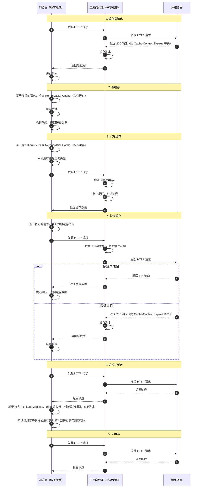
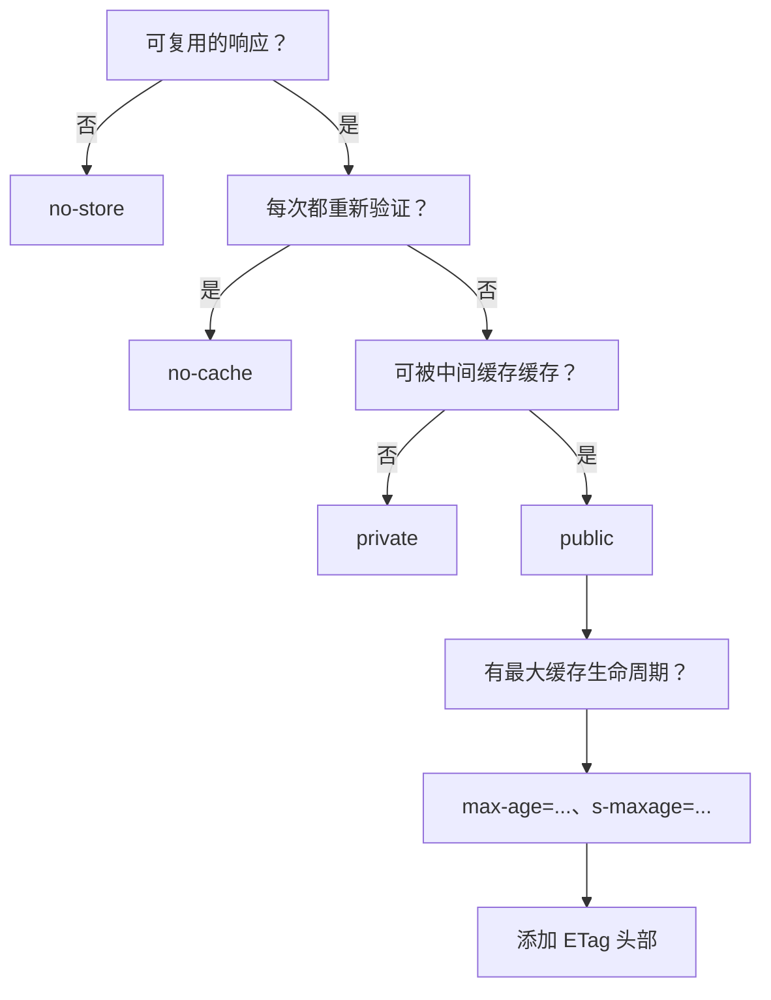

# HTTP 缓存

::: tip 学习目标

1. 了解 HTTP 缓存的作用及基本原理
2. 理解缓存控制相关 HTTP 头部的作用及最佳实践
3. 通过实战案例提高调试和优化缓存策略的能力

:::

## 缓存概述

缓存是指在客户端或代理服务器上存储的资源副本。通过合理配置静态资源或者动态资源的缓存策略，可以达到如下目的

1. **节约成本** 本地和代理服务器上的缓存副本，减少直接请求服务器的频率，从而降低网络带宽和服务器的资源消耗。
2. **提升用户体验** 通过缓存，缩短直接请求服务器的链路耗时，减少用户等待时间。
3. **优化网络性能** 通过本地和多级代理服务器的缓存，降低整个网络的负载，提升网络性能。

### 缓存是如何工作的

HTTP 缓存体系通常涉及三个核心角色

| 角色       | 描述                 | 缓存类型                       | 职责                             |
| ---------- | -------------------- | ------------------------------ | -------------------------------- |
| 客户端     | 如浏览器             | **私有缓存**(仅用户可用)       | 发起请求、存储、读取缓存         |
| 代理服务器 | 如 CDN/反向代理      | **共享缓存**(可供多个用户共享) | 缓存资源、转发请求               |
| 源服务器   | 提供原始资源的服务器 | 无                             | 下发最新资源、指定和验证缓存策略 |

:::tip
对于大型 web 应用，通常采用分布式架构，在代理服务器和源服务器上会存在复杂的网状结构，缓存也会存在多个层级，但是从协议的角度，本质上还是可以抽象为上述核心角色
:::

当用户发起请求时，整个缓存工作流程通常包括：

1. **缓存命中** 直接消费客户端或者代理服务器缓存，又可细分为
   1. **强缓存**：客户端缓存仍在有效期内，直接返回本地副本。
   2. **代理缓存命中**：客户端缓存无效但代理（共享缓存）命中，直接返回缓存资源。
   3. **启发式缓存**：未配置缓存策略，基于响应头部的 `Last-Modified`、`Date` 等字段，浏览器会根据启发式算法判断缓存是否过期。决定是否使用缓存副本。
2. **缓存协商** 本地或代理缓存过期，向源服务器请求，判断是否继续消费缓存或者重新获取数据
   1. **过期** 返回 200 响应，更新缓存
   2. **未过期** 返回 304 响应，继续使用缓存
3. **无缓存/缓存未命中** 每次均直接请求源服务器，更新缓存副本。



## 如何控制缓存？

HTTP 协议提供了丰富的头部字段控制缓存策略。整体可分为三块

1. **过期与存储控制** 确定缓存有效期限及对应的存储位置
2. **协商验证** 缓存过期后，确认是否继续使用过期缓存副本
3. **新鲜度检测** 判断缓存副本是否过期

### 过期与存储控制

| 头部/指令            | 描述                                                                                                                                                                                     | 适用范围  |
| -------------------- | ---------------------------------------------------------------------------------------------------------------------------------------------------------------------------------------- | --------- |
| **Cache-Control**    |                                                                                                                                                                                          |           |
| `max-age=<seconds>`  | 设定资源在缓存中可存活的最长秒数                                                                                                                                                         | 请求/响应 |
| `s-maxage=<seconds>` | 仅适用于共享缓存，覆盖 max-age                                                                                                                                                           | 响应      |
| `public`             | 标识资源可被任何缓存存储，包括共享缓存                                                                                                                                                   | 响应      |
| `private`            | 标识资源仅限私有缓存存储，不允许共享缓存                                                                                                                                                 | 响应      |
| `no-store`           | 禁止存储请求与响应的任何信息                                                                                                                                                             | 请求/响应 |
| `no-cache`           | 要求缓存前必须向源服务器验证资源有效性                                                                                                                                                   | 请求/响应 |
| **其他缓存控制头**   |                                                                                                                                                                                          |           |
| `Expires`            | 设置响应过期时间，详见 [RFC 7234 Expires](https://tools.ietf.org/html/rfc7234#section-5.3)。如果在 Cache-Control 响应头设置了 `max-age` 或者 `s-max-age` 指令，那么 Expires 头会被忽略。 | 响应      |
| `Pragma: no-cache`   | 是一个在 HTTP/1.0 中规定的通用首部,仅支持 `no-cache` 指令,强制要求缓存服务器在返回缓存的版本之前将请求提交到源头服务器进行验证。                                                         | 请求      |

### 协商缓存与验证机制

为避免频繁传输大流量数据，HTTP 缓存通过协商机制检测资源是否更新：

| 头部            | 描述                         | 使用场景                                                 |
| --------------- | ---------------------------- | -------------------------------------------------------- |
| `ETag`          | 资源唯一标识符               | 如果资源未改变，源服务器可返回 304，不必重新下载整个资源 |
| `Last-Modified` | 记录资源的最后修改日期       | 客户端可基于该时间进行校验                               |
| `Vary`          | 指定哪些请求头会影响缓存内容 | 适用于内容因用户代理或语言等而变化的情况                 |

通过协商缓存，客户端或代理缓存可以更高效地使用已有的缓存资源，同时节省带宽和请求延时。

### 新鲜度检测与扩展指令

对于缓存资源的新鲜性判断，核心公式为：

```ini
response_is_fresh = (fresh_lifetime > current_age)

```

- `response_is_fresh` 大于 0 表示缓存资源新鲜
- `fresh_lifetime` 服务端设定的缓存资源的过期时间,详见 [新鲜度计算方法](https://tools.ietf.org/html/rfc7234#section-4.2.1a)
- `current_age` 当前响应时间

> 注意同时存在多个重复头部,则设置新鲜度则该头部无效

- **Age** 消息头里包含消息对象在缓存代理中存贮的时长，以秒为单位。.
  Age 消息头的值通常接近于 0。表示此消息对象刚刚从原始服务器获取不久；其他的值则是表示代理服务器当前的系统时间与此应答消息中的通用消息头 Date 的值之差。详见 [RFC 7234, section 5.1: Age](https://tools.ietf.org/html/rfc7234#section-5.1)
- **Date**：服务器响应的时间，用于计算当前缓存是否仍然新鲜。
- **扩展指令**
  - **immutable**：标识资源一经获取后不再改变，客户端在有效期内无需反复验证。
  - **stale-while-revalidate**：允许客户端在资源过期时先行使用旧资源，并在后台更新。
  - **stale-if-error**：在资源更新失败或源服务器无法响应时，可继续使用过期缓存。

扩展指令能够进一步提升用户体验，尤其在高延迟网络环境下有明显优化效果。

## 实战案例

整体缓存选择策略可以参考 google 缓存决策树



典型的配置场景总结如下

1. **静态资源缓存** 设置 Cache-Control: public, max-age=31536000, immutable，确保图片、CSS、JS 等静态资源在长时间内从缓存加载，减少带宽消耗。

2. **动态接口的协商缓存** 对于 GET 接口，在响应头中设置 ETag 或 Last-Modified，使得第二次请求可以有效利用 304 协商响应，降低响应时间。

3. **代理与客户端缓存协同** 在配置 CDN 或反向代理时，使用 s-maxage 指令覆盖 max-age，确保共享缓存具有独立控制策略。
4. **调试工具与测试用例** 可以参考 GitHub 上的 [http 缓存测试用例](https://github.com/http-tests/cache-tests) 该测试用例验证了不同浏览器和代理服务对缓存配置的支持情况 及 [web 缓存用例](https://github.com/web-platform-tests/wpt/tree/master/fetch/http-cache) 来验证不同配置下缓存的实际行为。调试时借助浏览器开发者工具，观察 HTTP 请求响应头，验证缓存命中及更新逻辑。

## 其他

### 浏览器存储策略

浏览器存在磁盘缓存和内存缓存两种方式

- **硬盘缓存（disk cache）** 参考 [Where is the accurate cache folder of Chrome 75 in Mac](https://support.google.com/chrome/thread/9338226?hl=en), 访问 <chrome://version/>, 查看 **个人资料路径** 字段，缓存保存在 `个人资料路径/WebStorage` 目录下。**注意随着浏览器版本升级存储位置可能发生变化**, 具体架构详见 [chromium disk cache](https://www.chromium.org/developers/design-documents/network-stack/disk-cache/)
- **内存缓存（memory cache）** 详见 [浏览器是根据什么决定「from disk cache」与「from memory cache」](https://www.zhihu.com/question/64201378) 核心点概括 如下

用户操作对缓存影响，以 chrome 为例

行为 ｜ 结果
:--- | :---|
刷新，地址栏回车 ｜ 对缓存无影响
强制刷新 ｜ 会清除内存缓存，触发重新请求，对 `disk cache` 无影响
清空缓存并硬性重新加载 ｜ 会清除内存缓存和 `disk cache`, 重新加载所有资源
新开窗口，前进，后退 ｜ 会失效 memory-cache, 从 `disk cache` 尝试加载

浏览器保存缓存的原理详见 [chromium http-cache](https://www.chromium.org/developers/design-documents/network-stack/http-cache/), 可以基于测试用例理解 chromium 缓存的功能，源码 [http_cache_unittest](https://chromium.googlesource.com/chromium/src/+/refs/heads/main/net/http/http_cache_unittest.cc)

### 哪些资源可以被缓存

- **静态资源** 例如图片、CSS、JS 等
- **动态资源** get 接口可以被缓存，post 接口，协议上虽然没有限制，但是浏览器和服务器的实现上会限制缓存，通常不建议缓存 post 接口，因为 post 通常意味着对数据的修改，不是幂等接口，更详细的解释参考 [Is it possible to cache POST methods in HTTP?](https://stackoverflow.com/questions/626057/is-it-possible-to-cache-post-methods-in-http#answer-59569451)

## 参考资料

- [rfc7234 Hypertext Transfer Protocol (HTTP/1.1): Caching](https://tools.ietf.org/html/rfc7234) http 1.1 详解讲解缓存的内容
- [rfc5861 Cache-Control Extensions](https://tools.ietf.org/html/rfc5861) 约定缓存过期后的处理方式
- [HTTP Immutable Responses](https://tools.ietf.org/html/draft-mcmanus-immutable-00) 通过告知资源不可变来优化缓存过期后的资源消耗
- [mdn cache](https://developer.mozilla.org/en-US/docs/Web/HTTP/Caching) MDN 讲解缓存的使用
- [http 缓存控制小节](https://imweb.io/topic/5795dcb6fb312541492eda8c)
- [RFC 7234](http://www.rfcreader.com/#rfc7234_line119)
- [Caching Tutorial](https://www.mnot.net/cache_docs/) 详细讲解 cache 的使用
- [chromium http_cache.c](https://chromium.googlesource.com/chromium/src/+/refs/heads/main/net/http/http_cache.cc) chrome cache 源码
- [chrome cache](https://web.dev/articles/http-cache) google 开发指南讲解缓存如何工作
