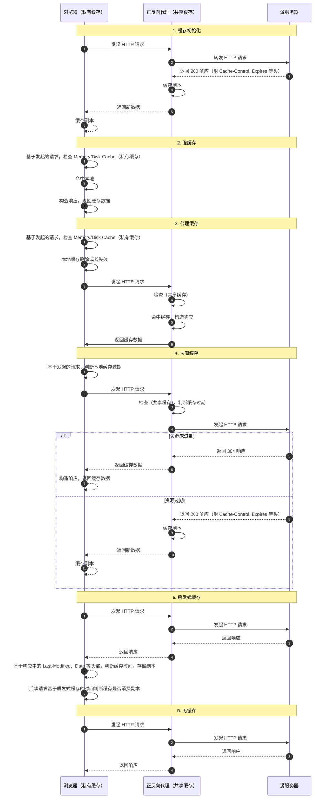

# HTTP 缓存

::: tip 学习目标

1. 知道缓存的作用，了解缓存的类型和基本工作原理
2. 掌握常见的缓存控制头，以及在不同场景下如何使用它们
3. 了解缓存新鲜度的计算方法，以及客户端保存缓存的原理

:::

## 缓存概述

### 什么是缓存

缓存是指在客户端或代理服务器上存储的资源副本。通过缓存可以减少对原始服务器的请求次数，提高访问速度和性能。

### 为什么需要缓存

1. **节约成本** 本地和代理服务器上的缓存副本，减少了直接请求服务器的频率，从而降低了网络带宽和服务器的资源消耗。
2. **提升了用户体验** 通过缓存，缩短了直接请求服务器的链路耗时，减少了用户等待时间。
3. **优化了网络性能** 通过本地和多级代理服务器的缓存，降低了整个网络的负载，提升了网络性能。

### 缓存是如何工作的

缓存涉及的参与方如下

| 角色       | 描述                  | 缓存类型                             | 职责                             |
| ---------- | --------------------- | ------------------------------------ | -------------------------------- |
| 客户端     | 通常是浏览器          | **私有缓存**(私有副本只有用户可用)   | 发起请求和存储缓存               |
| 代理服务器 | 通常是 CDN 或反向代理 | **共享缓存**(副本可以被多个用户共享) | 缓存和转发请求                   |
| 源服务器   | 提供原始资源的服务器  | 无                                   | 控制客户端和代理服务器的缓存策略 |

:::tip
对于大型 web 应用，通常采用分布式架构，在代理服务器和源服务器上会存在复杂的网状结构，缓存也会存在多个层级，但是从协议的角度，本质上还是可以抽象为上述关键角色
:::

通过配置代理服务器、源服务器的缓存策略，来控制客户端如何消费缓存。
客户端首次发送请求后会产生缓存副本，后续请求会基于缓存的状态来决定是否使用缓存。典型的场景如下

1. **缓存命中** 直接消费客户端或者代理服务器缓存，又可细分为
   1. **命中强缓存** 客户端缓存未过期，直接消费本地缓存
   2. **命中代理缓存** 客户端缓存过期，向代理服务器请求，代理服务器命中缓存，直接消费代理服务器缓存
   3. **启发式缓存** 在没有缓存配置的场景下浏览器基于响应的请求头，判断资源的缓存时间，决定是否消费缓存
2. **缓存协商** 本地或代理缓存过期，向源服务器请求，判断是否继续消费缓存或者重新获取数据
   1. **过期** 返回 200 响应，更新缓存
   2. **未过期** 返回 304 响应，继续使用缓存
3. **无缓存/缓存未命中** 每次请求都向服务器请求数据，或者未命中保存导致重新请求

## 如何控制缓存？

缓存的控制主要依赖于 HTTP 协议的头部字段来实现。核心协议为 [rfc9111](https://datatracker.ietf.org/doc/html/rfc9111)。整体缓存控制包含如下内容

1. 控制谁可以缓存，包括
   - **私有缓存** 客户端的副本
   - **共享缓存** 代理服务器的副本
2. 控制缓存的存储时间
3. 控制协商缓存的验证规则
4. 兼容策略 由于协议的向下兼容性，会存在多个版本的缓存控制头部，默认浏览器会优先使用最新的缓存控制头部，旧版本的头部会被忽略。这里统一讲解最新的缓存控制头部

常用的缓存头部罗列如下

| 头部名称      | 作用                                          | 说明              |
| ------------- | --------------------------------------------- | ----------------- |
| Cache-Control | 控制缓存的存储和过期时间                      | 主要用于 HTTP/1.1 |
| Expires       | 控制缓存的过期时间                            | 主要用于 HTTP/1.0 |
| Pragma        | 控制缓存的存储和过期时间                      | 主要用于 HTTP/1.0 |
| Last-Modified | 资源最后修改时间，用于协商缓存                | 主要用于 HTTP/1.0 |
| ETag          | 资源唯一标识符，用于协商缓存                  | 主要用于 HTTP/1.1 |
| Vary          | 控制缓存的存储和过期时间                      | 主要用于 HTTP/1.1 |
| Age           | 资源在缓存中存储的时间 ，用于判断缓存是否过期 | 主要用于 HTTP/1.1 |
| Date          | 响应时间，用于判断缓存是否过期                | 主要用于 HTTP/1.1 |

### cache-control

参考 [rfc7234](http://www.rfcreader.com/#rfc7234_line901) 常用指令如下

- 请求头支持的指令

  - `max-age=<seconds>` 请求方接受的最大缓存过期时间，注意 `客户端配置 max-age=0，会触发缓存验证`
  - `no-cache` 获取缓存前，客户端必须先校验
  - `no-store` 不该存储缓存，`chrome 验证对已缓存请求设置此指令无效`

- 响应头支持的指令

  - `max-age=<seconds>` 设置缓存的最大过期时间
  - `s-maxage=<seconds>` 覆盖 max-age 用于配置共享缓存的过期时间
  - `public` 表示响应可以被任何缓存存储，即使是身份验证的响应
  - `private` 表示响应只能存储为私有缓存，不允许共享缓存存储
  - `no-cache` 在缓存实现之前，强制验证缓存
  - `must-revalidate` 缓存必须在使用之前验证旧资源的状态，并且不可使用过期资源。
  - `proxy-revalidate` 与 must-revalidate 作用相同，但它仅适用于共享缓存（例如代理），并被私有缓存忽略。
  - `no-store` 缓存不应存储有关客户端请求或服务器响应的任何内容。
  - `no-transform` 不得对资源进行转换或转变。Content-Encoding, Content-Range, Content-Type 等 HTTP 头不能由代理修改。例如，非透明代理可以对图像格式进行转换，以便节省缓存空间或者减少缓慢链路上的流量。 no-transform 指令不允许这样做。
  - `max-stale` 期望过期时间的最大值 指令在浏览器端的作用
  - `min-fresh` 期望的新鲜度检查最小指
  - `no-transform` 不允许代理对缓存改动
  - `only-if-cached` 表明客户端只接受已缓存的响应，并且不要向原始服务器检查是否有更新的拷贝，的使用

- 非官方扩展指令
  - `immutable` 表示响应正文不会随时间而改变。资源（如果未过期）在服务器上不发生改变，因此客户端不应发送重新验证请求头（例如 If-None-Match 或 If-Modified-Since）来检查更新，即使用户显式地刷新页面。在 Firefox 中，immutable 只能被用在 `https`
  - `stale-while-revalidate=<seconds>` 表明客户端愿意接受陈旧的响应，同时在后台异步检查新的响应。秒值指示客户愿意接受陈旧响应的时间长度。
  - `stale-if-error=<seconds>` 表示如果新的检查失败，则客户愿意接受陈旧的响应。秒数值表示客户在初始到期后愿意接受陈旧响应的时间。

### 缓存校验头部

- `Age` 消息头里包含消息对象在缓存代理中存贮的时长，以秒为单位。.
  Age 消息头的值通常接近于 0。表示此消息对象刚刚从原始服务器获取不久；其他的值则是表示代理服务器当前的系统时间与此应答消息中的通用消息头 Date 的值之差。详见 [RFC 7234, section 5.1: Age](https://tools.ietf.org/html/rfc7234#section-5.1)
- `Expires` 设置响应过期时间，详见 [RFC 7234 Expires](https://tools.ietf.org/html/rfc7234#section-5.3)
  - `max-age` 用于设置私有缓存和共享缓存的过期时间
  - `s-maxage` 只会修改共享缓存的时间。
    > 结合两条指令可以同时控制私有缓存和共享缓存,其中私有缓存的过期时间为 `max-age` 共享缓存为 `s-maxage`, 如果在 Cache-Control 响应头设置了 `max-age` 或者 `s-max-age` 指令，那么 Expires 头会被忽略。
- `Pragma` 是一个在 HTTP/1.0 中规定的通用首部,仅支持 `no-cache` 指令,强制要求缓存服务器在返回缓存的版本之前将请求提交到源头服务器进行验证。
- `Last-Modified` 是一个响应首部，其中包含源头服务器认定的资源做出修改的日期及时间

参考 google 缓存策略图

### 新鲜检测

是指客户端是否可以利用缓存的内容作为请求响应。

判断条件为 `response_is_fresh =（fresh_lifetime> current_age）`

- `response_is_fresh` 大于 0 表示缓存资源新鲜
- `fresh_lifetime` 服务端设定的缓存资源的过期时间
- `current_age` 当前响应时间

`fresh_lifetime` 详见 [新鲜度计算方法](https://tools.ietf.org/html/rfc7234#section-4.2.1a)

> 注意同时存在多个重复头部,则设置新鲜度则该头部无效

## 实战案例

:::tip

规范和实现并不会完全一致，各浏览器对缓存的详细支持能力，可以参考

- [http 缓存测试用例](https://github.com/http-tests/cache-tests) 该测试用例验证了不同浏览器和代理服务对缓存配置的支持情况
- [http 缓存测试验证](https://github.com/web-platform-tests/wpt/tree/master/fetch/http-cache) 功能同上

:::

## 其他

### 浏览器存储策略

浏览器存在磁盘缓存和内存缓存两种方式

- **硬盘缓存（disk cache）** 参考 [Where is the accurate cache folder of Chrome 75 in Mac](https://support.google.com/chrome/thread/9338226?hl=en), 访问 <chrome://version/>, 查看 **个人资料路径** 字段，缓存保存在 `个人资料路径/WebStorage` 目录下。**注意随着浏览器版本升级存储位置可能发生变化**, 具体架构详见 [chromium disk cache](https://www.chromium.org/developers/design-documents/network-stack/disk-cache/)
- **内存缓存（memory cache）** 详见 [浏览器是根据什么决定「from disk cache」与「from memory cache」](https://www.zhihu.com/question/64201378) 核心点概括 如下

用户操作对缓存影响，以 chrome 为例

行为 ｜ 结果
:--- | :---|
刷新，地址栏回车 ｜ 对缓存无影响
强制刷新 ｜ 会清除内存缓存，触发重新请求，对 `disk cache` 无影响
清空缓存并硬性重新加载 ｜ 会清除内存缓存和 `disk cache`, 重新加载所有资源
新开窗口，前进，后退 ｜ 会失效 memory-cache, 从 `disk cache` 尝试加载

浏览器保存缓存的原理详见 [chromium http-cache](https://www.chromium.org/developers/design-documents/network-stack/http-cache/), 可以基于测试用例理解 chromium 缓存的功能，源码 [http_cache_unittest](https://chromium.googlesource.com/chromium/src/+/refs/heads/main/net/http/http_cache_unittest.cc)

### 哪些资源可以被缓存

- **静态资源** 例如图片、CSS、JS 等
- **动态资源** get 接口可以被缓存，post 接口，协议上虽然没有限制，但是浏览器和服务器的实现上会限制缓存，通常不建议缓存 post 接口，因为 post 通常意味着对数据的修改，不是幂等接口，更详细的解释参考 [Is it possible to cache POST methods in HTTP?](https://stackoverflow.com/questions/626057/is-it-possible-to-cache-post-methods-in-http#answer-59569451)

## 参考资料

- [rfc7234 Hypertext Transfer Protocol (HTTP/1.1): Caching](https://tools.ietf.org/html/rfc7234) http 1.1 详解讲解缓存的内容
- [rfc5861 Cache-Control Extensions](https://tools.ietf.org/html/rfc5861) 约定缓存过期后的处理方式
- [HTTP Immutable Responses](https://tools.ietf.org/html/draft-mcmanus-immutable-00) 通过告知资源不可变来优化缓存过期后的资源消耗
- [mdn cache](https://developer.mozilla.org/en-US/docs/Web/HTTP/Caching) MDN 讲解缓存的使用
- [http 缓存控制小节](https://imweb.io/topic/5795dcb6fb312541492eda8c)
- [RFC 7234](http://www.rfcreader.com/#rfc7234_line119)
- [Caching Tutorial](https://www.mnot.net/cache_docs/) 详细讲解 cache 的使用
- [chromium http_cache.c](https://chromium.googlesource.com/chromium/src/+/refs/heads/main/net/http/http_cache.cc) chrome cache 源码
- [partitioning the cache](https://developers.google.com/web/updates/2020/10/http-cache-partitioning) 说明当前 chrome 缓存是如何工作的
