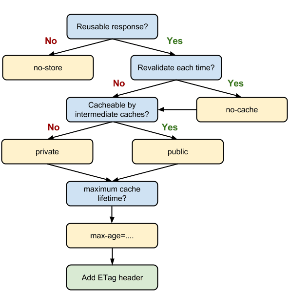

# cache

**详细讲解 http 缓存控制**

[toc]

## 缓存概述

用户频繁向服务器请求不经常变化的资源，会造成无谓的带宽消耗和资源浪费 。HTTP 定义了缓存和相关控制策略来解决此问题。利用缓存可以提升用户性能，实现对资源的重用。

## 缓存类型

### 私有缓存 (private cache)
保存在本地的缓存，通常指浏览器缓存

### 共享缓存 (shared cache)
保存在网络节点中的缓存，例如 CDN，代理缓存等。

## 新鲜检测
是指客户端是否可以利用缓存的内容作为请求响应。

判断条件为 `response_is_fresh =（fresh_lifetime> current_age）`

* `response_is_fresh` 大于 0 表示缓存资源新鲜
* `fresh_lifetime` 服务端设定的缓存资源的过期时间
* `current_age` 当前响应时间

`fresh_lifetime` 详见 [新鲜度计算方法](https://tools.ietf.org/html/rfc7234#section-4.2.1a)

> 注意同时存在多个重复头部,则设置新鲜度则该头部无效

## 缓存控制头部汇总
### Cache-Control
通用首部控制缓存策略

参考 [rfc7234](http://www.rfcreader.com/#rfc7234_line901) 常用指令如下

* 请求头支持的指令
  * `max-age=<seconds>` 请求方接受的最大缓存过期时间，`chrome 85.0.4183.121` 验证，客户端配置 max-age=0，会触发缓存验证
  * `no-cache` 获取缓存前，客户端必须先校验
  * `no-store` 不该存储缓存，chrome 验证对已缓存请求设置此指令无效

* 响应头支持的指令
  * `public` 表示响应可以被任何对象缓存(客户端,代理服务器等)
  * `private` 表示响应只能存在客户端
  * `no-cache` 在缓存实现之前，强制验证缓存
  * `must-revalidate` 缓存必须在使用之前验证旧资源的状态，并且不可使用过期资源。
  * `proxy-revalidate` 与must-revalidate作用相同，但它仅适用于共享缓存（例如代理），并被私有缓存忽略。
  * `no-store` 缓存不应存储有关客户端请求或服务器响应的任何内容。
  * `no-transform` 不得对资源进行转换或转变。Content-Encoding, Content-Range, Content-Type等HTTP头不能由代理修改。例如，非透明代理可以对图像格式进行转换，以便节省缓存空间或者减少缓慢链路上的流量。 no-transform指令不允许这样做。
  * `max-age=<seconds>` 相对于请求设定的最大周期
  * `s-maxage=<seconds>` 覆盖 max-age 用于共享缓存

* 非官方扩展指令
  * `immutable` 
表示响应正文不会随时间而改变。资源（如果未过期）在服务器上不发生改变，因此客户端不应发送重新验证请求头（例如If-None-Match或If-Modified-Since）来检查更新，即使用户显式地刷新页面。在Firefox中，immutable只能被用在 https:// transactions. 有关更多信息，
  * `stale-while-revalidate=<seconds>` 表明客户端愿意接受陈旧的响应，同时在后台异步检查新的响应。秒值指示客户愿意接受陈旧响应的时间长度。
  * `stale-if-error=<seconds>` 表示如果新的检查失败，则客户愿意接受陈旧的响应。秒数值表示客户在初始到期后愿意接受陈旧响应的时间。

## 缓存校验头部
* `Age` 消息头里包含消息对象在缓存代理中存贮的时长，以秒为单位。.
Age消息头的值通常接近于0。表示此消息对象刚刚从原始服务器获取不久；其他的值则是表示代理服务器当前的系统时间与此应答消息中的通用消息头 Date 的值之差。详见 [RFC 7234, section 5.1: Age](https://tools.ietf.org/html/rfc7234#section-5.1)
* `Expires`  设置响应过期时间，详见 [RFC 7234 Expires](https://tools.ietf.org/html/rfc7234#section-5.3)
   * `max-age` 用于设置私有缓存和共享缓存的过期时间
   * `s-maxage` 只会修改共享缓存的时间。
   > 结合两条指令可以同时控制私有缓存和共享缓存,其中私有缓存的过期时间为 `max-age` 共享缓存为 `s-maxage`, 如果在Cache-Control响应头设置了 `max-age` 或者 `s-max-age` 指令，那么 Expires 头会被忽略。
* `Pragma` 是一个在 HTTP/1.0 中规定的通用首部,仅支持 `no-cache` 指令,强制要求缓存服务器在返回缓存的版本之前将请求提交到源头服务器进行验证。
* `Last-Modified` 是一个响应首部，其中包含源头服务器认定的资源做出修改的日期及时间

参考 google 缓存策略图

* [ ] 缓存空中碰撞

## 浏览器缓存控制

### 缓存类型

**disk cache**

参考 [Where is the accurate cache folder of Chrome 75 in Mac](https://support.google.com/chrome/thread/9338226?hl=en), 访问 <chrome://version/>, 查看 **个人资料路径** 字段，缓存保存在 `个人资料路径/cache` 目录下。

**memory cache**

### 用户操作对缓存影响

> 以 chrome 为例

行为 ｜ 结果
:--- | :---|
刷新，地址栏回车 ｜ 对缓存无影响
强制刷新 ｜ 会清除内存缓存，触发重新请求，对 `disk cache` 无影响
清空缓存并硬性重新加载 ｜ 会清除内存缓存和 `disk cache`, 重新加载所有资源
新开窗口，前进，后退 ｜ 会失效 memory-cache, 从 `disk cache` 尝试加载

## 知识点
1. HTTP 缓存实现对响应资源的复用，可以提升性能和节约带宽

## TODO
* [ ] http 是否可缓存，参考 [Is it possible to cache POST methods in HTTP?](https://stackoverflow.com/questions/626057/is-it-possible-to-cache-post-methods-in-http), 实践未得到验证
* [ ] max-stale 期望过期时间的最大值 指令在浏览器端的作用
* [ ] min-fresh 期望的新鲜度检查最小指
* [ ] `no-transform` 的作用需验证
* [ ] `only-if-cached` 表明客户端只接受已缓存的响应，并且不要向原始服务器检查是否有更新的拷贝，的使用

## 参考资料
* [ Hypertext Transfer Protocol (HTTP/1.1): Caching](https://tools.ietf.org/html/rfc7234)
* [Cache-Control Extensions](https://tools.ietf.org/html/rfc5861)
* [HTTP Immutable Responses](https://tools.ietf.org/html/draft-mcmanus-immutable-00)
* [mdn cache](https://developer.mozilla.org/en-US/docs/Web/HTTP/Caching)
* [web cache](http://www.web-caching.com/)
* [http 缓存测试验证](https://github.com/http-tests/cache-tests)
* [http 缓存测试验证](https://github.com/web-platform-tests/wpt/tree/master/fetch/http-cache)
* [http 缓存响应指令](https://httpwg.org/specs/rfc7234.html#cache-response-directive)
* [http 缓存控制小节](https://imweb.io/topic/5795dcb6fb312541492eda8c)
* [RFC 7234](http://www.rfcreader.com/#rfc7234_line119)
* [Caching Tutorial](https://www.mnot.net/cache_docs/)
* [ ] [chromium http cache](https://www.chromium.org/developers/design-documents/network-stack/http-cache)
* [ ] [chromium http_cache.h](https://chromium.googlesource.com/chromium/src/+/master/net/http/http_cache.h)
* [ ] [chromium disk cache](https://www.chromium.org/developers/design-documents/network-stack/disk-cache)
