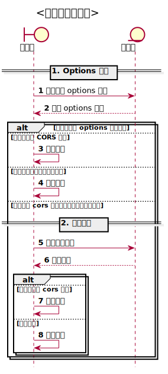

# CORS

**详细讲解 CORS 协议**

## CORS 概述
浏览器会受到同源策略限制。 [CORS 规范 (coress orgin resource share)](https://www.w3.org/TR/CORS/) 是现代浏览器对于跨域场景资源共享的标准解决方案。

相比 JSONP， CORS 允许发送 `POST` 请求，并且结合 CORS 扩展的请求头，可以实现更加完善的跨域控制。

CORS 请求分为两种
* 简单请求（simple request）直接向服务端发送请求
* 预检请求 （preflight request） 在实际请求发出前，浏览器会自动向服务端发送 `Options` 请求，然后发出实际请求

## 简单请求
参考 [MDN](https://developer.mozilla.org/en-US/docs/Web/HTTP/CORS#Simple_requests) 简单请求需要同时满足如下条件
1. 请求方法限制,只能是如下几种
	* HEAD
	* GET
	* POST
2. 请求头限制,只能设定如下请求头
	* Accept
	* Accept-Language
	* Content-Language
	* Content-Type
	* DPR
	* Downlink
	* Save-Data
	* Viewport-Width
	* Width
		> 后面几个头部用于指定客户端信息,详见 [HTTP Client Hints](https://httpwg.org/http-extensions/client-hints.html#dpr)
3. 内容限制,`Content-Type` 只能是如下类型
	* `text/plain`
	* `multipart/form-data`
	* `application/x-www-form-urlencoded`

简单请求会携带 `Orgin` 头部说明请求源。服务端的响应头部必须包含

* `Access-Control-Allow-Origin` 说明允许的跨域源。合法的值为 `<origin> | *`

`Access-Control-Allow-Origin` 有如下限制：

1. 响应头部只能包含一个 `Access-Control-Allow-Origin`，多个相同头部，浏览器判定为非法
2. `<Origin>` 的值只能为一个具体的地址例如 `http://localhost:3000` 不支持多个值分隔，`http://localhost:3000,http://localhost:3000` 、 `http://localhost:30*` 均为非法值。只能采用 `*` 表示允许所有请求源，**此外若为单一值时，必须和请求头部的 `Orgin` 完全一致**，若 `Access-Control-Allow-Origin` 设置为 `http://localhost:3000/`  而请求头部 `Origin` 为 `http://localhost:3000` 由于不相同，浏览器仍会判定为非法请求。 

浏览器对于跨域的请求的响应头部有严格限制，利用 `fetch` 等 API 发起跨域请求时，参考 [MDN](https://developer.mozilla.org/en-US/docs/Web/HTTP/Headers/Access-Control-Expose-Headers)， 响应对象的头部只会包含如下几种 

* **Cache-Control**
* **Content-Language**
* **Content-Length**
* **Content-Type**
* **Expires**
* **Last-Modified**
* **Pragma**

服务端需设置 `Access-Control-Expose-Headers` 头部，控制哪些响应头，在跨域返回的响应对象中可获取。合法值为 `<header-name>[,<header-name>]* | *`

## 预检请求
CORS 类型为预检请求时，浏览器会自动发送 `Options` 请求给服务端，服务端正确响应 	`Options` 请求后，浏览器才会发送实际请求。

`Options` 请求会携带如下请求头

* `Access-Control-Request-Method` 发送允许的请求方法
* `Access-Control-Request-Headers` 发送允许的请求头

服务端对 `Options` 请求的响应头部如下

* `Access-Control-Allow-Origin` 必须包含，声明服务端支持的跨域源
* `Access-Control-Allow-Methods` 可选，申明服务端对后续实际请求支持的方法，**注意GET，POST 请求不受此限制**, 详见 [stackoverflow](https://stackoverflow.com/questions/42705306/access-control-allow-methods-doesnt-seem-to-be-working)
* `Access-Control-Allow-Headers` 可选，申明服务端对后续实际请求支持的请求头
* `Access-Control-Max-Age` 可选，为了避免每次都需要发送 `Options` 请求进行预检，服务端可设置 `Options` 请求的缓存时间，单位为 s，在有效期内浏览器会直接发送实际请求，当超过有效期后会重新发送 `Otpions` 请求进行预检，注意不同浏览器对有效期最大限制不同，详见 [Access-Control-Max-Age](https://developer.mozilla.org/en-US/docs/Web/HTTP/Headers/Access-Control-Max-Age)

浏览器接收到服务端对 `Options` 请求响应后，会先判断实际请求是否符合服务端限制要求，若不符合则不会触发实际请求，直接报错。

实际请求校验合法后，浏览器才会发送该请求，此时服务端任需响应 `Access-Control-Allow-Origin` 字段。

整个交互流程如下图 

## 请求凭证
默认 CORS 请求不会携带 `Cookie` 或 `Authentication` 等凭证信息，浏览器端需显示声明该配置，参考 [fetch credential](https://fetch.spec.whatwg.org/#concept-request-credentials-mode)，对于 `fetch` api 需申明 `credentials` 配置为 `include` 。

此时服务端必须配置如下响应头部

* `Access-Control-Allow-Credentials` 值必须为 `true` 表示允许客户端携带凭证，对于预检时发出的 `Options` 请求也必须包含此头部
* `Access-Control-Allow-Origin` 的值必须和请求的 `	Origin` 一致,**不能设置为 `*`**，，对于预检时发出的 `Options` 请求也必须包含此头部，服务端可根据请求的 `Origin` 动态设置请求头，实现类似 `*` 的效果。

CORS 协议的整个决策树如下图

## 知识点总结
1. CORS(Corss Origin Resource Share) 协议解决同源策略限制下，服务资源共享问题
2. CORS 类别
   1. 简单请求，无 `Options` 请求
   2. 预检请求，发送 `Options` 请求作为预检
      1. 预检请求 `Options` 响应非法时，不会触发实际请求
3. 默认跨域请求不携带 Cookie 等凭证信息，浏览器需显示配置此逻辑
   1. fetch 为 `credentials = include`
   2. XMLHttpRequest 为 `withCredentials = true`
4. 核心请求头部
   1. 请求头
      1. `Origin` 标识跨域请求，简单和预检请求都必须携带
      2. `Access-Control-Request-Method` 用于预检请求设置允许的方法
      3. `Access-Control-Request-Headers` 用于预检请求设置允许的请求头
   2. 响应头
      1. `Access-Control-Allow-Orgin` 设置允许接收跨域请求的源
         1. 支持 `<Origin> | *` 模式
         2. 对于包含凭证的请求必须返回明确的 `<Orgin>`
         3. 响应头部不能重复出现
      2. `Access-Control-Allow-Credentials` 携带凭证的请求必须包含此请求头，值需为 `true` 
      3. `Access-Control-Expose-Headers` 设置浏览器响应对象可以解析的额外请求头，支持 `<header-name>[,header-name] | *` 模式
      4. `Access-Control-Max-Age` 设置预检请求 `Options` 的缓存时间
      5. `Access-Control-Allow-Methods` 设置预检请求允许的请求类型
         1. 只在预检请求 `Options` 中起作用，限制服务端允许接收的请求类型。
         2. `POST,GET` 不受此限制
         3. 浏览器会在发送实际请求前，检查实际请求是否符合限制，不符合直接报错
      6. `Access-Control-Allow-Headers` 设置预检请求允许的请求头部，
         1. 只在预检请求 `Options` 中起作用，限制服务端允许接收的请求类型。
         2. 浏览器会在发送实际请求前，检查实际请求是否符合限制，不符合直接报错

## 参考资料
* [wiki CORS](https://en.wikipedia.org/wiki/Cross-origin_resource_sharing#cite_note-22)
* [fetch spec](https://fetch.spec.whatwg.org/#cors-request)
* [CORS mdn](https://developer.mozilla.org/en-US/docs/Web/HTTP/cors)
* [CORS w3c](https://w3c.github.io/webappsec-CORS-for-developers/)
* [Developers don't understand CORS](https://fosterelli.co/developers-dont-understand-cors)
* [Using CORS](https://www.html5rocks.com/en/tutorials/cors/)
* [cors error](https://developer.mozilla.org/en-US/docs/Web/HTTP/CORS/Errors)

